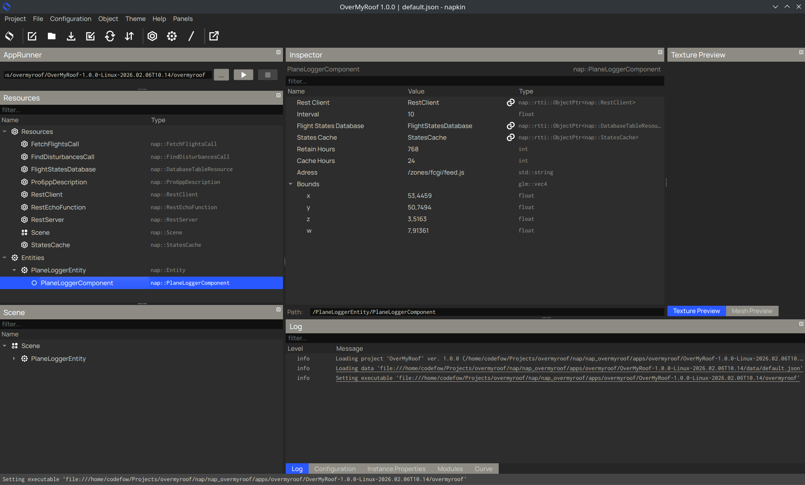
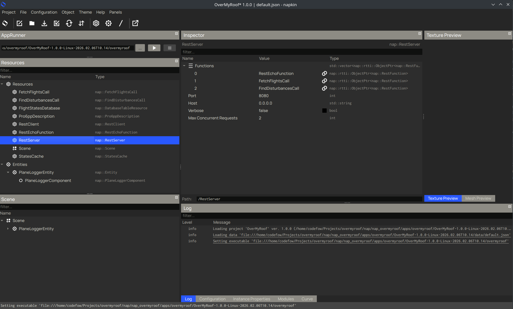

OverMyRoof headless NAP Application
=======================

# Description

This is a headless NAP application that uses flightradar24.com to track flights within a certain geographical bounding box. This data is stored and can be queried using a REST API with two endpoints.

At a configurable interval, the application requests the flightradar24.com API to get the current flights over a specific geographical bounding box. The application then stores all flights found in a SQLITE database.

The application also uses the pro6pp API to get the coordinates a location based on the postal code. These coordinates are then cached and refreshed after a certain amount of time. See https://www.pro6pp.nl

The application exposes a REST API to get the current and past flights over a specific location. This data is served as a JSON object.

## Requirements

- The application has been tested on Ubuntu 24.04 on x86_64 architecture.
- An internet connection is required to access the flightradar24.com API.
- Enough storage space to store the flight data in the SQLITE database.
- A valid pro6pp API key

## Install and run the application

- Download the latest release from the [releases page](https://github.com/TimGroeneboom/overmyroof/releases)
- Untar the downloaded file to a directory of your choice.
- Open a terminal and navigate to the directory where you untarred the application.
- Replace the line in [data/pro6pp.key](data/pro6pp.key) with your pro6pp API key.
- Type `./overmyroof` to run the application.

## Configure the application

1. open terminal
2. cd to the directory where you unzipped the application and type in `napkin/napkin` to open the napkin editor. You should see the following editor window
 
3. Most of the stuff should not be touched and is of no importance to the user. However, some variables can be interesting to change. These are the properties of the `PlaneLoggerComponent` . Tap this component (as shown in the screenshot) and you can edit the following properties:
   * `interval` amount of seconds between each request to the flightradar24.com API. The default value is 10 seconds. Setting this value to a lower value will increase the amount of requests to the API and may cause your IP to be blocked. 
   * `Retain Hours` amount of hours to retain the flight data in the SQLITE database. The default value is 768 hours (one month). Setting this value to a lower value will reduce the amount of storage space used by the application. You can set this as high as you want, depending on storage space.
   * `Cache Hours` amount of hours to retain flight data in RAM. The default is 24 hours. Setting this value to a lower value will reduce the amount of RAM used by the application, but may increase the response time of the REST API. You can set this as high as you want, depending on RAM available on the machine.
   * `Bounds` the geographical bounds of the area to track. The default value is `53.445884704589844,50.74940490722656,3.516303300857544,7.913614749908447` which is a bounding box around The Netherlands. The format is `lat_min,lat_max,lon_min,lon_max`. 
4. To change the port of the server, tap on the `RestServer` resource and change the `Port` property to the desired port. The default value is 8080. See screenshot below.

5. In order to change some properties, edit the values in the editor and hit CTRL+S to save the changes. The application will automatically reload the changes and apply them. 
6. These are the most important properties to change. You can take a look at other resources and most properties are self-explanatory. 

## Endpoints

Two endpoints are available, examples:

### Find flights over a location
 
- `http://127.0.0.1:8080/find_flights?streetnumber_and_premise=202&postal_code=1118cp&altitude=10000&radius=4000&begin=20260206000000&end=20260207000000`

Finds flights over the location with the given street number and premise, postal code, altitude, radius, begin and end time. The altitude is in meters, the radius is in meters, the begin and end time are in the format `YYYYMMDDhhmmss`. The response is a JSON object with the following structure:

```json
{
  "status": "ok",
  "data": {
    "flights": [
      {
        "icao": "SWR883P",
        "reg": "SWR",
        "aircraft_type": "BCS3",
        "lat": 52.282,
        "lon": 4.7189,
        "altitude": 297.1799,
        "timestamp": 20260206085937,
        "distance": 3130.7316
      },
      {
        "icao": "EJU32KA",
        "reg": "EZY",
        "aircraft_type": "A20N",
        "lat": 52.283,
        "lon": 4.722,
        "altitude": 281.94,
        "timestamp": 20260206100050,
        "distance": 2917.3666
      }
    ],
    "ms": 0
  }
}
```

Instead of `streetnumber_and_premise` and `postal_code`, the endpoint also accepts `latitude` and `longitude` parameters to specify the location. If both are provided, the application will use the `latitude` and `longitude` parameters and skip the pro6pp API call.

### Find disturbances

- `http://127.0.0.1:8080/find_disturbances?streetnumber_and_premise=202&postal_code=1118cp&altitude=10000&radius=4000&begin=20260206000000&end=20260207000000&period=60&occurrences=2`

Finds disturbances over the location with the given street number and premise, postal code, altitude, radius, begin and end time, period and occurrences. The altitude is in meters, the radius is in meters, the begin and end time are in the format `YYYYMMDDhhmmss`, the period is in minutes and the occurrences is the number of times a flight has hit the given parameters to register as a disturbance. The response is a JSON object with the following structure:

```json
{
  "status": "ok",
  "data": {
    "disturbance_periods": [
      {
        "begin": 20260206100050,
        "end": 20260206100638,
        "flights": [
          {
            "icao": "EJU32KA",
            "reg": "EZY",
            "aircraft_type": "A20N",
            "lat": 52.283,
            "lon": 4.722,
            "altitude": 281.94,
            "timestamp": 20260206100050
          },
          {
            "icao": "KLM95P",
            "reg": "KLM",
            "aircraft_type": "B738",
            "lat": 52.318,
            "lon": 4.7719,
            "altitude": 220.9799,
            "timestamp": 20260206100211
          },
          {
            "icao": "KLM29A",
            "reg": "KLM",
            "aircraft_type": "B738",
            "lat": 52.317,
            "lon": 4.7639,
            "altitude": 198.1199,
            "timestamp": 20260206100333
          },
          {
            "icao": "EFD3T",
            "reg": "EFD",
            "aircraft_type": "C25B",
            "lat": 52.2849,
            "lon": 4.728,
            "altitude": 266.7,
            "timestamp": 20260206100537
          },
          {
            "icao": "KLM59M",
            "reg": "KLM",
            "aircraft_type": "A21N",
            "lat": 52.317,
            "lon": 4.7579,
            "altitude": 205.74,
            "timestamp": 20260206100638
          }
        ],
        "occurrences": 5
      }
    ],
    "ms": 2
  }
}
```

Instead of `streetnumber_and_premise` and `postal_code`, the endpoint also accepts `latitude` and `longitude` parameters to specify the location. If both are provided, the application will use the `latitude` and `longitude` parameters and skip the pro6pp API call.

## Build from source

The NAP application uses the `napdatabase` and `naprest` module.

- Clone NAP from [here](https://github.com/TimGroeneboom/nap/) branch `overmyroof` into a directory of your choice.

- Make sure all requirements for NAP are installed. Follow the instructions in the NAP README to install the requirements. Finally, run `./check_build_environment.sh` from the NAP root folder to check if all requirements are installed.

- Create a folder `modules` in the NAP root directory if it does not exist.

- OverMyRoof uses the module `napdatabase` from [here](https://github.com/TimGroeneboom/napdatabase/). Clone `napdatabase` branch `overmyroof` into the directory of `nap/modules` and run `./tools/setup_module.sh napdatabase` from the NAP root folder.

- OverMyRoof uses the module `naprest` from [here](https://github.com/naivisoftware/naprest/). Clone `naprest` branch `overmyroof` into the directory of `nap/modules` and run `./tools/setup_module.sh naprest` from the NAP root folder

- Clone this repository branch `main` into the `apps/overmyroof`  directory. Add `add_subdirectory(apps/overmyrooof)` and `add_subdirectory(apps/overmyrooof/module)` to `CMakeLists.txt` in the NAP root folder.

